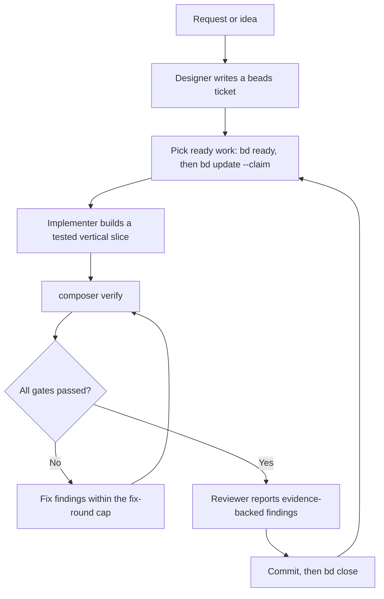

# Agentic Laravel development template

A Laravel starter template engineered for AI coding agents. It ships a custom OpenCode harness that gives agents structured tools, workflows, and project context, so they make better decisions, follow project conventions, and finish tasks faster.

> [!NOTE]
> Badges and clone URLs point at the current repository slug (`ShehabMohamedGamal/simple-laravel`). Update them after the planned repository rename.


## Features

- Custom OpenCode harness: five specialized agents, six plugins, two commands, and two MCP servers, all versioned with the repo.
- `composer verify`: one command that runs three hard gates and eight report steps on every change.
- Beads (`bd`) issue tracking, so agent work survives across sessions.
- Pest 5 with Laravel, Agent, Browser, Faker, PHPStan, Rector, Stressless, and type-coverage plugins.
- Laravel Boost MCP for Laravel-aware documentation and schema tools.
- Context7 cache plugin for current library docs without burning API calls.
- RTK command rewriting for smaller tool output.
- Docs-retrieval fallthrough and a capability registry, so agents never guess where knowledge lives.
- Normal Laravel shape underneath: Vite 8, Tailwind v4, Telescope, Pail, Tinker.

## Why this template?

Agents fail in ordinary repos for predictable reasons: they invent APIs, forget conventions, lose state between sessions, and skip verification. This template removes those failure modes before the first prompt.

- Agents read `AGENTS.md` and `CONTEXT.md` first, so vocabulary, invariants, and workflow come from the repo, not the model's memory.
- Docs fall through MCP, then local slices, then Context7, then the web, so answers come from current sources instead of hallucination.
- Beads keeps tasks, decisions, and handoffs outside the chat window.
- `composer verify` gives agents and humans the same objective definition of done.
- The zero-comments gate and type-coverage floor keep agent-written code readable and strict.

The result is a repo where you describe the outcome and the agent handles the path, with guardrails that catch drift early.

## How the OpenCode harness works

The harness lives in `.opencode/` and `.agents/skills/` and loads automatically when you start OpenCode in this repo.

### Agents

| Agent | Role | Permissions |
|---|---|---|
| Designer | Turns requests into implementation-ready beads tickets | Read-only, cannot edit files |
| Requirements gatherer | Elicits requirements and writes PRDs from client evidence | Can edit, cannot delete or stage files |
| Implementer | Builds a ticket as a working, tested vertical slice | Full edit and bash access |
| Researcher | Investigates questions against primary sources and writes evidence-backed notes | Read-only subagent |
| Reviewer | Reviews changes against standards and specs | Read-only subagent |

### Plugins

| Plugin | What it does |
|---|---|
| `no-comments` | Blocks any edit that adds a comment. Zero comments allowed; self-documenting code is the bar |
| `no-memory` | Blocks memory tools. Durable knowledge belongs in beads issues, not agent memory |
| `session-log` | Logs every session to `.opencode/logs/` for review and handoff |
| `context7-cache` | Persistent TTL disk cache in front of Context7. Exposes `context7_resolve`, `context7_docs`, `context7_stats`, `context7_clear` |
| `rtk` | Rewrites bash commands through `rtk rewrite` for token savings. Self-disables with a warning if the `rtk` binary is missing |
| `codebase-index` | Maintains the local index automatically and exposes a retrieval-only `codebase_index` tool |

### Commands

| Command | What it does |
|---|---|
| `/implement-all` | Implements all ready beads tickets, each in a fresh OpenCode worktree session |
| `/codebase-index` | Searches the hybrid code index (symbols, refs) before agents read files |

### Skills

`.agents/skills/` carries about 30 skills that agents load on demand. They come from three sources:

| Source | Skills in this template |
|---|---|
| [Matt Pocock's skill collection](https://github.com/mattpocock/skills) | `ask-matt` (the router over the collection), `grilling`, `grill-me`, `grill-with-docs`, `wait-what`, `wayfinder`, `to-spec`, `to-tickets`, `to-questionnaire`, `triage`, `prototype`, `research`, `handoff`, `diagnosing-bugs`, `domain-modeling`, `codebase-design`, `improve-codebase-architecture`, `resolving-merge-conflicts`, `wizard`, `writing-for-agents` |
| [Human Layer](https://humanlayer.dev) | `show-me`: visual explanations with diagrams, code-shape sketches, and HTML artifacts |
| First-party, written for this harness | `beads`, `implement-loop`, `self-review`, `setup-ae-harness`, `interview-prep`, `prd-builder`, `competitor-research`, `laravel` (merged from the Laravel Boost skills), `tdd-lite` (a first-party variant of Matt Pocock's `tdd`, adapted to the verify chain) |

Skills resolve through the capability registry in `docs/agents/registry.md`. Agents never hardcode skill names.

### MCP servers

| Server | Source | Purpose |
|---|---|---|
| `laravel-boost` | Project config, via `php artisan boost:mcp` | Laravel docs search, database schema and query tools, browser logs |
| `chrome-devtools` | Project config, via `npx chrome-devtools-mcp@latest` | Browser control and inspection for frontend work |

### Do I need to install anything?

No. Start OpenCode in a clone of this repo and the harness installs itself:

| Component | How it installs | Your action |
|---|---|---|
| npm plugins: `opencode-openai-codex-auth`, `opencode-pty`, `@opencode-trace/plugin` | OpenCode installs them with Bun at first startup and caches them under `~/.cache/opencode/node_modules` | None |
| File plugins: `no-comments`, `no-memory`, `session-log`, `context7-cache`, `rtk` | Loaded from `.opencode/plugins/` at startup, versioned with the repo | None |
| MCP servers: `laravel-boost`, `chrome-devtools` | OpenCode launches them from `opencode.json` on each session. `npx` fetches `chrome-devtools-mcp` on first run; `boost:mcp` works after `composer install` | None |
| Skills: the full set under `.agents/skills/` | Versioned with the repo, loaded on demand through `docs/agents/registry.md` | None |

Three optional per-machine items need manual setup: the `rtk` binary (see the RTK setup section), Chrome for the `chrome-devtools` server, and `CONTEXT7_API_KEY` for the Context7 cache.

Codebase Index also needs Python and an installed `codebase-index` CLI. See the setup section below. Its policy lives in `AGENTS.md`, not a skill.

### Codebase index setup

The OpenCode plugin builds a missing index at startup, debounces agent edits, and checks for outside changes every 30 seconds. It keeps one maintenance process active per plugin instance and locks writes per checkout. It uses the CLI's file discovery and ignore rules, so cache files do not trigger indexing loops. Missing tools or provider failures produce warnings instead of stopping agent work.

Automatic indexing is on by default. Embeddings are off by default. Agents use the `codebase_index` tool for `symbol`, `search`, `refs`, `explain`, `describe`, and `path`. The tool exposes no maintenance commands. The wrappers reject the four prohibited commands and refuse to build a missing index during retrieval.

Run the repeatable wizard to choose automatic indexing, an embedding provider, its model, and its endpoint:

```bash
bash scripts/setup-codebase-index.sh
```

```powershell
./scripts/setup-codebase-index.ps1
```

Both wizards validate the provider before replacing the configuration. They ask before applying settings and refreshing the index. Candidate API keys stay in memory until confirmation and successful validation; cancellation or failed validation preserves the saved key. The Ollama preset uses `http://localhost:11434/v1/embeddings` and defaults to `unclemusclez/jina-embeddings-v2-base-code:latest`. Choose the exact tag listed by your Ollama server. You can also choose another local Sentence Transformers model or an authenticated OpenAI-compatible endpoint.

The runner uses an importable Codebase Index package or the Python interpreter beside the installed CLI, including pipx installations. Set `CBX_PYTHON` if your interpreter lives elsewhere. This integration is tested against Codebase Index 1.9.0. Embeddings also require the CLI's optional `sqlite-vec` support; the local backend requires Sentence Transformers. The scripts do not install packages or models for you. Selecting a local model can download its files through Sentence Transformers.

All machine-local files live in the ignored `.claude/cache/codebase-index/` directory:

- `config.json` holds the canonical CLI and automation settings.
- `setup.env` remembers wizard answers. It does not control the index directly.
- `credentials.env` holds an optional external API key. `CBX_EMBEDDINGS_API_KEY` in the process environment takes precedence. Keep this file private; on Windows, check the directory's inherited access permissions.
- `index.sqlite` holds the index. Model, endpoint, or dimension changes replace incompatible vectors automatically. Content-addressed vectors remain reusable only under the same provider/model/dimension identity.

The loopback-only Ollama preset supplies a non-secret placeholder key. Remote endpoints require HTTPS and an explicit key. Enabled embeddings send indexed code chunks to the selected endpoint. No settings or keys go to GitHub or Laravel's application `.env`.

Use the same controls without the wizard:

```bash
bash scripts/codebase-index.sh status
bash scripts/codebase-index.sh configure --embeddings off
bash scripts/codebase-index.sh configure --auto off
bash scripts/codebase-index.sh configure --embeddings ollama --model unclemusclez/jina-embeddings-v2-base-code:latest
bash scripts/codebase-index.sh test-provider
bash scripts/codebase-index.sh query search "authentication" --json
```

PowerShell accepts the same arguments through `./scripts/codebase-index.ps1`. An operator can run `refresh` or `refresh --rebuild` explicitly. Agents leave maintenance to the plugin. If embeddings fail, automatic maintenance keeps text and symbol retrieval working and retries embeddings later.

Run the integration checks with `python3 scripts/test-codebase-index.py` and `node --test scripts/test-codebase-index-plugin.mjs`. The plugin test uses Node 22.18 or newer for native TypeScript loading. A Python environment with the installed CLI and its embedding extras is required for vector tests.

### RTK setup

The plugin itself is bundled and loads automatically; the `rtk` binary is the one per-machine install. Install it once so command rewriting works:

```bash
# Install rtk (>= 0.23.0). Pick one channel, for example:
cargo install rtk
# or grab a release binary from the rtk repository and put it on your PATH

rtk --version   # confirm it resolves
```

The plugin is optional. Without the binary it warns once and disables itself; everything else keeps working.

## Agent workflow



For larger batches, `/implement-all` fans the loop out: it claims every ready ticket and runs each one in its own git worktree with its own OpenCode session, so tickets do not block each other.

## Project structure

```
.
├── AGENTS.md              # The agent contract: workflow, verification, writing rules
├── CONTEXT.md             # Domain glossary, invariants, and decisions
├── opencode.json          # OpenCode config: plugins and MCP servers
├── .opencode/
│   ├── agents/            # Designer, implementer, requirements-gatherer, researcher, reviewer
│   ├── commands/          # /implement-all, /codebase-index
│   ├── gates/             # Deterministic shell gates shared across clients
│   ├── plugins/           # no-comments, no-memory, session-log, context7-cache, rtk
│   └── logs/              # Session logs (generated)
├── .agents/skills/        # ~30 skills: implement-loop, laravel, tdd-lite, grilling, wayfinder, ...
├── .beads/                # Beads issue store (embedded Dolt database)
├── docs/agents/           # Issue tracker, docs retrieval, triage labels, capability registry
├── scripts/feedback/      # verify.sh, no-comments.sh, lsp.php, mutation.sh, crap.sh, ...
├── app/                   # Your Laravel application code
├── tests/                 # Pest suites: Unit, Feature, Arch
└── compose.yaml           # Services-only compose for backing infrastructure
```

## Requirements

| Requirement | Version / notes |
|---|---|
| PHP | 8.3 or newer (this template is developed on PHP 8.5) |
| Composer | 2.x |
| Node.js + npm | Node 20+ (Vite 8, Tailwind v4) |
| Database | PostgreSQL or SQLite |
| Git | Any recent version |
| OpenCode | Latest, to run the agent harness |
| Beads (`bd`) | Optional but recommended, the issue tracker CLI |
| `rtk` | Optional, enables command rewriting (plugin needs 0.23.0+) |
| Xdebug or PCOV | Optional coverage driver, needed for the mutation and CRAP report steps in `composer verify` |
| Chrome | Optional, used by the `chrome-devtools` MCP server |

## Installation

```bash
git clone https://github.com/ShehabMohamedGamal/simple-laravel.git
cd simple-laravel
composer install
cp .env.example .env
php artisan key:generate
php artisan migrate
npm install
npm run dev
php artisan serve
```

`composer setup` does the same in one step: it installs dependencies, copies the environment file, generates the key, migrates, and builds the frontend.

Start OpenCode in the repo once and the plugins and MCP servers install and load automatically. Only the optional `rtk` binary needs a manual install (see the RTK setup section).

> [!TIP]
> Install Laravel Boost's guidelines into your agent clients with `php artisan boost:mcp --install`. Clients already covered by `boost.json`: Claude Code, Codex, OpenCode, and Zed.

## Environment setup

Copy `.env.example` to `.env` and adjust:

```dotenv
APP_NAME="Your App"
DB_CONNECTION=pgsql        # or sqlite
DB_DATABASE=simple_template
CACHE_STORE=database
QUEUE_CONNECTION=database
```

Optional integrations:

```bash
# Context7 docs cache (any number of keys; the plugin rotates through them)
export CONTEXT7_API_KEY="your-key-here"

# Playwright browsers, for Pest Browser checks
npx playwright install
```

Values like the API key above are examples; set your own.

## Running the project

```bash
composer dev          # full dev environment via artisan dev
php artisan serve     # app only, at http://127.0.0.1:8000
npm run dev           # Vite dev server with HMR
npm run build         # production frontend build
```

Telescope, Pail, and Nightwatch ship installed but disabled in testing. Enable them in your local `.env` when you need them.

## Available commands

| Command | Purpose |
|---|---|
| `composer setup` | First-time install: deps, env, key, migrate, frontend build |
| `composer dev` | Run the development environment |
| `composer verify` | Full gate and report chain over staged changes |
| `composer test` | Clear config, then run `artisan test` |
| `composer analyse` | PHPStan via Larastan, level 6 with strict and deprecation rules |
| `composer pint` | Check code style with Pint |
| `composer deptrac` | Check architecture layers |
| `composer mutate` | Mutation testing over the whole suite |
| `vendor/bin/rector --dry-run` | Refactor preview (outside the verify chain) |
| `vendor/bin/pest --agent='<snippet>'` | One-shot agent-verified check, for example `--agent='get("/")->assertOk();'` |
| `bd ready` / `bd show <id>` / `bd update <id> --claim` / `bd close <id>` | Beads issue workflow |

## Development guidelines

`AGENTS.md` is the contract for humans and agents alike. The short version:

- Write in active voice, one idea per sentence, no filler and no AI tells.
- Use the exact terms from the `CONTEXT.md` glossary; flag missing concepts instead of inventing names.
- Retrieve docs in order: MCP first, then `docs/agents/llms/` slices, then Context7, then the web.
- Look work up in beads before creating it, and claim tickets with `bd update <id> --claim`.
- Never hardcode skill or agent names; resolve them through `docs/agents/registry.md`.
- Custom issue types: `wayfinder`, `spec`, `implementation`, `review`.

The full rules live in `AGENTS.md` and `docs/agents/`. Change behavior by editing those files, not by prompting around them.

## Testing

Pest 5 runs three suites: `tests/Unit`, `tests/Feature`, and `tests/Arch`.

- Test impact analysis (TIA) runs only the tests your change touches, locally and filtered.
- `--parallel` is the default in `composer verify`.
- `RefreshDatabase` applies to all suites through `tests/Pest.php`.
- The `Arch` suite enforces structural rules with Pest Arch testing.
- Pest Browser plus Playwright covers real browser checks.
- The Agent plugin runs one-shot browser and app assertions through `pest --agent`.

> [!TIP]
> Xdebug slows every request. Keep it disabled for everyday runs and enable it only when a step needs coverage, such as `report: mutation` and `report: crap`, or when you are debugging. PCOV is a lighter choice if you only ever need coverage.

```bash
vendor/bin/pest --parallel                 # full suite
vendor/bin/pest tests/Feature              # one suite
vendor/bin/pest --agent='get("/")->assertOk();'   # one-shot check
```

## Code style

`composer verify` is the definition of done. Three gates decide the result; a failure ends with a `FAILED GATES:` line naming the failed gates.

1. **No-comments gate**: token-based detection of added comment lines in PHP and Blade.
2. **Pest**: the full suite, in parallel.
3. **Type coverage**: minimum 80 percent.

Eight `report:` steps follow the gates and never fail the chain: Pint, Deptrac, PHPStan, Laravel LSP diagnostics, mutation testing on new tests, CRAP scores, PHPMetrics, and `composer audit`. Their output is feedback; act on it.

> [!IMPORTANT]
> Never weaken a gate, an ignore pattern, or a test to make a failure disappear. Fix the code the gate is pointing at.

## Contributing

1. Find or create a beads ticket (`bd create --title=... --description=...`), and set a triage label such as `ready-for-agent` or `needs-triage`.
2. Claim it with `bd update <id> --claim`.
3. Make the change with tests. Follow the guidelines above.
4. Stage your work and run `composer verify`. All gates must pass.
5. Open a pull request that references the ticket.

Issues that need human decisions get the `ready-for-human` label; anything stale or orphaned gets swept with `bd stale` and `bd orphans`.

## Roadmap

These are examples of planned directions, not commitments:

- Publish the harness installer (`setup-ae-harness` skill) as a standalone command.
- Add CI wiring that runs `composer verify` on pull requests.
- Expand the local docs slices under `docs/agents/llms/` for offline agent work.
- More Arch rules covering queue jobs and domain events.

## License

This template is open-sourced software licensed under the [MIT license](LICENSE).
