# Beads Export

*Generated: Wed, 09 Sep 2026 00:29:37 EEST*

## Summary

| Metric | Count |
|--------|-------|
| **Total** | 18 |
| Open | 3 |
| In Progress | 0 |
| Blocked | 0 |
| Closed | 15 |

## Quick Actions

Ready-to-run commands for bulk operations:

```bash
# Close all open items
br close simple-template-0pn simple-template-6om simple-template-xoq

# View high-priority items (P0/P1)
br show simple-template-0pn

```

## Table of Contents

- [🟢 simple-template-0pn Agent-boosted Laravel template](#simple-template-0pn-agent-boosted-laravel-template)
- [🟢 simple-template-6om High-level workflow fine-tuning](#simple-template-6om-high-level-workflow-fine-tuning)
- [🟢 simple-template-xoq Modular MVC profile (nwidart/laravel-modules)](#simple-template-xoq-modular-mvc-profile-nwidart-laravel-modules)
- [⚫ simple-template-0pn.1.2 T1.implementer: Rewrite implementer.md system prompt (grilling task)](#simple-template-0pn-1-2-t1-implementer-rewrite-implementer-md-system-prompt-grilling-task)
- [⚫ simple-template-0pn.1.1 T1.planner: Rewrite planner.md system prompt (grilling task)](#simple-template-0pn-1-1-t1-planner-rewrite-planner-md-system-prompt-grilling-task)
- [⚫ simple-template-0pn.3 T3: Git hooks and the feedback loop](#simple-template-0pn-3-t3-git-hooks-and-the-feedback-loop)
- [⚫ simple-template-0pn.2 T2: Docs layer (AGENTS.md, skills, docs/agents/)](#simple-template-0pn-2-t2-docs-layer-agents-md-skills-docs-agents)
- [⚫ simple-template-0pn.1 T1: Rewrite agent system prompts (workflow-agnostic)](#simple-template-0pn-1-t1-rewrite-agent-system-prompts-workflow-agnostic)
- [⚫ simple-template-6om.1.5 Q5: Metrics for success and acceptance criteria for this epic](#simple-template-6om-1-5-q5-metrics-for-success-and-acceptance-criteria-for-this-epic)
- [⚫ simple-template-6om.1.4 Q4: How to integrate wayfinder into the daily workflow](#simple-template-6om-1-4-q4-how-to-integrate-wayfinder-into-the-daily-workflow)
- [⚫ simple-template-6om.1.3 Q3: Improvements needed in session conventions and handoffs](#simple-template-6om-1-3-q3-improvements-needed-in-session-conventions-and-handoffs)
- [⚫ simple-template-6om.1.2 Q2: Specific pain points in the current planning → tickets → implementation → review loop](#simple-template-6om-1-2-q2-specific-pain-points-in-the-current-planning-tickets-implementation-review-loop)
- [⚫ simple-template-6om.1.1 Q1: How to measure workflow efficiency and identify bottlenecks](#simple-template-6om-1-1-q1-how-to-measure-workflow-efficiency-and-identify-bottlenecks)
- [⚫ simple-template-6om.1 [wayfinder:map] High-level workflow fine-tuning](#simple-template-6om-1-wayfinder-map-high-level-workflow-fine-tuning)
- [⚫ simple-template-0pn.1.5 T1.req-gatherer: Rewrite requirements-gatherer.md system prompt (grilling task)](#simple-template-0pn-1-5-t1-req-gatherer-rewrite-requirements-gatherer-md-system-prompt-grilling-task)
- [⚫ simple-template-0pn.1.4 T1.researcher: Rewrite researcher.md system prompt (grilling task)](#simple-template-0pn-1-4-t1-researcher-rewrite-researcher-md-system-prompt-grilling-task)
- [⚫ simple-template-0pn.1.3 T1.reviewer: Rewrite reviewer.md system prompt (grilling task)](#simple-template-0pn-1-3-t1-reviewer-rewrite-reviewer-md-system-prompt-grilling-task)
- [⚫ simple-template-0pn.1.6 T1.consistency: Cross-prompt consistency pass + close T1 (grilling task)](#simple-template-0pn-1-6-t1-consistency-cross-prompt-consistency-pass-close-t1-grilling-task)

---

## Dependency Graph

```mermaid
graph TD
    classDef open fill:#50FA7B,stroke:#333,color:#000
    classDef inprogress fill:#8BE9FD,stroke:#333,color:#000
    classDef blocked fill:#FF5555,stroke:#333,color:#000
    classDef closed fill:#6272A4,stroke:#333,color:#fff

    simple-template-0pn["simple-template-0pn<br/>Agent-boosted Laravel template"]
    class simple-template-0pn open
    simple-template-0pn1["simple-template-0pn.1<br/>T1: Rewrite agent system prompts (wor..."]
    class simple-template-0pn1 closed
    simple-template-0pn11["simple-template-0pn.1.1<br/>T1.planner: Rewrite planner.md system..."]
    class simple-template-0pn11 closed
    simple-template-0pn12["simple-template-0pn.1.2<br/>T1.implementer: Rewrite implementer.m..."]
    class simple-template-0pn12 closed
    simple-template-0pn13["simple-template-0pn.1.3<br/>T1.reviewer: Rewrite reviewer.md syst..."]
    class simple-template-0pn13 closed
    simple-template-0pn14["simple-template-0pn.1.4<br/>T1.researcher: Rewrite researcher.md ..."]
    class simple-template-0pn14 closed
    simple-template-0pn15["simple-template-0pn.1.5<br/>T1.req-gatherer: Rewrite requirements..."]
    class simple-template-0pn15 closed
    simple-template-0pn16["simple-template-0pn.1.6<br/>T1.consistency: Cross-prompt consiste..."]
    class simple-template-0pn16 closed
    simple-template-0pn2["simple-template-0pn.2<br/>T2: Docs layer (AGENTS.md, skills, do..."]
    class simple-template-0pn2 closed
    simple-template-0pn3["simple-template-0pn.3<br/>T3: Git hooks and the feedback loop"]
    class simple-template-0pn3 closed
    simple-template-6om["simple-template-6om<br/>High-level workflow fine-tuning"]
    class simple-template-6om open
    simple-template-6om1["simple-template-6om.1<br/>(wayfinder:map) High-level workflow f..."]
    class simple-template-6om1 closed
    simple-template-6om11["simple-template-6om.1.1<br/>Q1: How to measure workflow efficienc..."]
    class simple-template-6om11 closed
    simple-template-6om12["simple-template-6om.1.2<br/>Q2: Specific pain points in the curre..."]
    class simple-template-6om12 closed
    simple-template-6om13["simple-template-6om.1.3<br/>Q3: Improvements needed in session co..."]
    class simple-template-6om13 closed
    simple-template-6om14["simple-template-6om.1.4<br/>Q4: How to integrate wayfinder into t..."]
    class simple-template-6om14 closed
    simple-template-6om15["simple-template-6om.1.5<br/>Q5: Metrics for success and acceptanc..."]
    class simple-template-6om15 closed
    simple-template-xoq["simple-template-xoq<br/>Modular MVC profile (nwidart/laravel-..."]
    class simple-template-xoq open

    simple-template-0pn1 -.-> simple-template-0pn
    simple-template-0pn11 -.-> simple-template-0pn1
    simple-template-0pn12 -.-> simple-template-0pn1
    simple-template-0pn13 -.-> simple-template-0pn1
    simple-template-0pn14 -.-> simple-template-0pn1
    simple-template-0pn15 -.-> simple-template-0pn1
    simple-template-0pn16 -.-> simple-template-0pn1
    simple-template-0pn2 -.-> simple-template-0pn
    simple-template-0pn3 -.-> simple-template-0pn
    simple-template-6om1 -.-> simple-template-6om
    simple-template-6om11 -.-> simple-template-6om1
    simple-template-6om12 -.-> simple-template-6om1
    simple-template-6om13 -.-> simple-template-6om1
    simple-template-6om14 -.-> simple-template-6om1
    simple-template-6om15 -.-> simple-template-6om1
    simple-template-6om15 ==> simple-template-6om11
    simple-template-6om15 ==> simple-template-6om12
    simple-template-6om15 ==> simple-template-6om13
    simple-template-6om15 ==> simple-template-6om14
```



---

<a id="simple-template-0pn-agent-boosted-laravel-template"></a>

## 🚀 simple-template-0pn Agent-boosted Laravel template

| Property | Value |
|----------|-------|
| **Type** | 🚀 epic |
| **Priority** | ⚡ High (P1) |
| **Status** | 🟢 open |
| **Created** | 2026-09-06 15:51 |
| **Updated** | 2026-09-06 15:51 |

### Description

Make this repo a ready template for agent-boosted Laravel development (simple MVC profile on main; a modular MVC profile lives in its own epic).

Settled decisions from the 2026-09-06 grilling session (do not re-litigate):
- OpenCode is the only first-class harness for now; agent contracts live in .opencode/agents/ as the source of truth. Claude Code / Codex adapters are out of scope.
- xdebug-mcp is out of scope for now.
- Token efficiency of the workflow is a cross-cutting constraint on every ticket, not a separate ticket.
- Tickets in this epic are grilling tickets: goal + pointers + recorded pain points + open questions. The assigned agent must run a grilling/design pass to reach shared understanding BEFORE acting; the checklist emerges from that pass, never pre-baked.

Housekeeping deliberately NOT ticketed (owner: Shehab): delete CLAUDE.md, relocate docs/system prompt guide.md into docs/agents/, fix the Sail docker-build network failure.

<details>
<summary>📋 Commands</summary>

```bash
# Start working on this issue
br update simple-template-0pn -s in_progress

# Add a comment
br comment simple-template-0pn 'Your comment here'

# Change priority (0=Critical, 1=High, 2=Medium, 3=Low)
br update simple-template-0pn -p 1

# View full details
br show simple-template-0pn
```

</details>

---

<a id="simple-template-6om-high-level-workflow-fine-tuning"></a>

## 🚀 simple-template-6om High-level workflow fine-tuning

| Property | Value |
|----------|-------|
| **Type** | 🚀 epic |
| **Priority** | 🔹 Medium (P2) |
| **Status** | 🟢 open |
| **Created** | 2026-09-06 15:52 |
| **Updated** | 2026-09-06 15:52 |

### Description

Its own round of improving the end-to-end agentic workflow: planning → tickets → implementation → review loops, session conventions, wayfinder usage, handoffs. Tune the whole once the parts (T1 prompts, T2 docs layer, T3 hooks/feedback loop in epic simple-template-0pn) are fixed.

Context: the repo owner reports agents 'behaving like there is no system prompt at all' — this epic assumes T1–T3 have landed and tunes the overall workflow beyond per-agent fixes.

This epic is a grilling epic: child tickets are authored during a grilling pass with the repo owner, not pre-baked. Token efficiency of the workflow is a cross-cutting constraint on all children.

<details>
<summary>📋 Commands</summary>

```bash
# Start working on this issue
br update simple-template-6om -s in_progress

# Add a comment
br comment simple-template-6om 'Your comment here'

# Change priority (0=Critical, 1=High, 2=Medium, 3=Low)
br update simple-template-6om -p 1

# View full details
br show simple-template-6om
```

</details>

---

<a id="simple-template-xoq-modular-mvc-profile-nwidart-laravel-modules"></a>

## 🚀 simple-template-xoq Modular MVC profile (nwidart/laravel-modules)

| Property | Value |
|----------|-------|
| **Type** | 🚀 epic |
| **Priority** | ☕ Low (P3) |
| **Status** | 🟢 open |
| **Created** | 2026-09-06 15:52 |
| **Updated** | 2026-09-06 15:52 |

### Description

Second profile of the template: modular MVC using nwidart/laravel-modules, on a dedicated 'modular' branch forked at a 'divergence-point' tag so shared agent-infrastructure fixes land on main first and cherry-pick cleanly to both branches (decision from the 2026-09-06 grilling session).

Child tickets (install + baseline on the modular branch; module-structure conventions doc; tooling adaptation — larastan/deptrac/gates made module-aware) are to be authored when the branch is actually cut, not now.

Simple MVC profile stays on main. Agent infrastructure stays identical on both branches by convention.

<details>
<summary>📋 Commands</summary>

```bash
# Start working on this issue
br update simple-template-xoq -s in_progress

# Add a comment
br comment simple-template-xoq 'Your comment here'

# Change priority (0=Critical, 1=High, 2=Medium, 3=Low)
br update simple-template-xoq -p 1

# View full details
br show simple-template-xoq
```

</details>

---

<a id="simple-template-0pn-1-2-t1-implementer-rewrite-implementer-md-system-prompt-grilling-task"></a>

## 📋 simple-template-0pn.1.2 T1.implementer: Rewrite implementer.md system prompt (grilling task)

| Property | Value |
|----------|-------|
| **Type** | 📋 task |
| **Priority** | ⚡ High (P1) |
| **Status** | ⚫ closed |
| **Created** | 2026-09-06 16:12 |
| **Updated** | 2026-09-06 21:13 |
| **Closed** | 2026-09-06 21:13 |

### Description

Rewrite .opencode/agents/implementer.md as a proper system-prompt contract per docs/system prompt guide.md. Grilling task: run a grilling pass with the owner BEFORE writing.

Settled constraints (from T1 grilling, do not re-litigate):
- Strip /implementing and /code-review skill references (do not exist in repo skills; workflow baking).
- Keep commit duty and verification behavior, phrased generically (no Conventional Commit prescription, no gate/hook references — T3 owns the deterministic layer).
- Keep vertical-slice/TDD, naming, and no-comments content pending grilling pass.
- Keep READ-WRITE; mode 'all' and temp 0.2 stand unless the pass argues otherwise.

Open questions for the grilling pass: which Engineering Principles survive the strip line; how much of the Testing Principles section stays; stop-rule wording.

### Notes

Grilling decisions (2026-09-06): commit duty removed entirely — version control convention lives outside the system prompt (no commits, no working-tree language, no review step; owner runs /code-review externally with its two-perspective subagents); prompt is skill-free (TDD loop inline, no /implementing or /tdd references); todo-tool tracking kept (owner: feedback loop that improves output quality); refusal rule added to match planner's promise — refuses tickets lacking vertical-slice context, reports what is missing, does not start; description fixed to guide format; mode=all and temp=0.2 unchanged; documentation rule rephrased generically (consult owning project's official docs — 'documentation retrieval convention' reference stripped). Kept verbatim: vertical slice definition, TDD loop, design/naming/no-comments rules, testing principles, If Blocked, Stop Rule. Acceptance scenarios: (1) handed a context-less ticket → refuses and reports what vertical-slice context is missing; (2) handed a proper ticket → implements via smallest observable steps with one failing test per criterion; (3) finished work → full suite and project checks green, report states verification per criterion; (4) prompt contains zero version control or review references.

### Dependencies

- 🔗 **parent-child**: `simple-template-0pn.1`

---

<a id="simple-template-0pn-1-1-t1-planner-rewrite-planner-md-system-prompt-grilling-task"></a>

## 📋 simple-template-0pn.1.1 T1.planner: Rewrite planner.md system prompt (grilling task)

| Property | Value |
|----------|-------|
| **Type** | 📋 task |
| **Priority** | ⚡ High (P1) |
| **Status** | ⚫ closed |
| **Created** | 2026-09-06 16:11 |
| **Updated** | 2026-09-06 20:15 |
| **Closed** | 2026-09-06 20:15 |

### Description

Rewrite .opencode/agents/planner.md as a proper system-prompt contract per docs/system prompt guide.md. Grilling task: run a grilling pass with the owner BEFORE writing; the checklist emerges from the pass.

Recorded pain points (ground truth):
- Planner is eager to write code instead of planning.
- Agents behave as if there is no system prompt at all.
- Frontmatter fence is malformed ('----------------' instead of '---') — fix during rewrite.

Settled constraints (from T1 grilling, do not re-litigate):
- Content-only rewrite; keep temp 0.6 (judgment work — do not flatten).
- Strip repo/workflow references (e.g. 'read the repository's issue-tracking conventions'); proposed edit:deny + PLAN-ONLY write policy to be confirmed in the grilling pass.
- Existing frontmatter is a starting point, not gospel.

Open questions for the grilling pass: edit:deny or prose-only; ticket output format; dependency rules keep/tighten.

### Notes

Grilling decisions (2026-09-06): content-only rewrite; planner stays mode=primary, temp=0.6 (judgment work — owner rejected 0.1); structural write-lock via permission edit:deny + PLAN-ONLY policy (fixes eager-coding pain point); lean general ticket constraints, no rigid template (owner: template = coupling to future repo issue conventions); no ambiguity/Q&A machinery baked in (owner drives planning with grill-me / grill-with-docs / wayfinder skills); dependency rules split into code dependencies (files/modules/shared code/implementation order) and domain dependencies (concepts/decisions/invariants established by another ticket); vertical slices are a hard requirement — tickets that cannot be a full slice must carry vertical-slice context, and the prompt states the implementer agent refuses tickets lacking it; malformed frontmatter fence fixed. Strip line held: 'read the repository's issue-tracking conventions' removed. Acceptance scenarios: (1) handed a bugfix request → returns a plan, zero edits; (2) every ticket is a vertical slice or carries vertical-slice context; (3) dependencies labelled code vs domain; (4) no rejected-alternative discussion in output.
Closed: planner.md rewrite reviewed and user proceeded to next ticket without objections.

### Dependencies

- 🔗 **parent-child**: `simple-template-0pn.1`

---

<a id="simple-template-0pn-3-t3-git-hooks-and-the-feedback-loop"></a>

## 📋 simple-template-0pn.3 T3: Git hooks and the feedback loop

| Property | Value |
|----------|-------|
| **Type** | 📋 task |
| **Priority** | ⚡ High (P1) |
| **Status** | ⚫ closed |
| **Created** | 2026-09-06 15:51 |
| **Updated** | 2026-09-07 17:16 |
| **Closed** | 2026-09-07 17:16 |

### Description

Make quality enforcement deterministic (mechanical, not prompt-dependent) and give agents a discoverable feedback loop.

Already-approved direction (2026-09-06):
- Deterministic gate chain via a composer verify script: pint --test, larastan (composer analyse), rector --dry-run, pest — wired into git pre-commit hooks so gates fire regardless of model obedience.

Existing material to build on:
- .beads/hooks/ — beads git hooks (pre-commit, pre-push, post-checkout, post-merge, prepare-commit-msg)
- .opencode/gates/no-comments.sh + .opencode/plugins/no-comments.ts — existing deterministic no-comments gate and plugin
- Toolchain verified working: composer analyse (larastan level 6), pint, pest; rector/infection/deptrac installed but not yet configured (no rector.php / infection.json5 / deptrac.yaml)

Explicitly out of scope: xdebug-mcp (excluded for now by the repo owner). The repo owner handles the Sail docker-build network fix themselves.

Open questions are expected — grill the repo owner before wiring anything. Grilling ticket: no pre-baked checklist.

### Notes

T3 landed 2026-09-07. Grilling decisions: (1) chain = pint --test, no-comments gate (staged diff), deptrac, phpstan level 6, pest --parallel (TIA via tests/Pest.php); (2) standalone infection removed, replaced by pest --mutate --parallel --everything as manual composer mutate — pest skips TIA during mutate runs (mutually exclusive modes), and with no MSI floor a mutation step in the chain could never fail a commit; (3) rector.php configured (php83 sets + code-quality, dead-code, early-return, type-declaration, pest coding-style) but kept out of the chain per owner; (4) phpstan baseline fixed first: stale ignore pattern dropped, pest-plugin-phpstan extension wired into phpstan.neon, two Pest-strict findings fixed in example tests; (5) deptrac.php (v4 PHP config) layers Controller/Service/Model with ruleset Controller->Service+Model, Service->Model; (6) agents keep a --no-verify escape hatch for genuine tool misbehavior, documented with the reason-in-commit-message + beads-issue duty; (7) feedback loop documented plainly in AGENTS.md Verification section + .ai/rules/verify-loop.md (glob **). Wiring: composer scripts pint/deptrac/mutate/verify; verify chain appended to .beads/hooks/pre-commit below the beads markers (bd preserves content outside its markers across installs). Verified: hook blocks a staged comment (exit 1 + remediation message), passes a clean commit (tested with throwaway commits, both undone); composer verify green in ~5s. Rector dry-run reports 24 skeleton files it would change; applying is the owner's call.

### Dependencies

- 🔗 **parent-child**: `simple-template-0pn`

---

<a id="simple-template-0pn-2-t2-docs-layer-agents-md-skills-docs-agents"></a>

## 📋 simple-template-0pn.2 T2: Docs layer (AGENTS.md, skills, docs/agents/)

| Property | Value |
|----------|-------|
| **Type** | 📋 task |
| **Priority** | ⚡ High (P1) |
| **Status** | ⚫ closed |
| **Created** | 2026-09-06 15:51 |
| **Updated** | 2026-09-06 21:54 |
| **Closed** | 2026-09-06 21:54 |

### Description

Fine-tune the docs layer so agents actually discover and follow it: AGENTS.md (root pointers), vendored skills (.agents/skills/ + skills-lock.json), OpenCode-specific skills (.opencode/skills/), and docs/agents/* (docs-retrieval.md, domain.md, issue-tracker.md, triage-labels.md).

This is where agent workflow-specialization knowledge lives: whatever was deliberately kept out of the agent prompts in T1 lands here so it is discoverable without bloating every session context.

Known current state (facts, verified 2026-09-06):
- AGENTS.md is terse pointers only; beads tracker was empty until the 2026-09-06 planning session.
- No doc references the owner's global feedback tools (xrepl, xtrace, xstep, xprofile, xcoverage) — agents cannot know they exist.
- CLAUDE.md deletion and relocation of docs/system prompt guide.md are handled by the repo owner, not this ticket.

Open questions are expected — grill the repo owner before restructuring anything. Grilling ticket: no pre-baked checklist.

### Notes

2026-09-07 grilling session, settled: (1) no conventions doc — conventions are enforced deterministically (T3) or inferable; (2) no workflow doc — out of scope, changes nothing for the agent; (3) no skills doc, skills layer untouched — interview-prep/competitor-research/prd-builder are the requirements-gatherer's named skill kit; (4) xrepl/xtrace/xstep/xprofile/xcoverage premise dropped: verified nonexistent on this machine (only match is glibc xtrace, unrelated); (5) CONTEXT-MAP.md not created — domain.md handles absence silently. Landed: CONTEXT.md placeholder skeleton, docs/agents/llms/ convention dir, CLAUDE.md symlinked to AGENTS.md, setup-ae-harness templates synced to install the new shape.

### Dependencies

- 🔗 **parent-child**: `simple-template-0pn`

---

<a id="simple-template-0pn-1-t1-rewrite-agent-system-prompts-workflow-agnostic"></a>

## 📋 simple-template-0pn.1 T1: Rewrite agent system prompts (workflow-agnostic)

| Property | Value |
|----------|-------|
| **Type** | 📋 task |
| **Priority** | ⚡ High (P1) |
| **Status** | ⚫ closed |
| **Created** | 2026-09-06 15:51 |
| **Updated** | 2026-09-06 21:13 |
| **Closed** | 2026-09-06 21:13 |

### Description

Rewrite the five custom agents in .opencode/agents/ (requirements-gatherer, researcher, planner, implementer, reviewer) as proper system-prompt contracts.

Authoritative guide: docs/system prompt guide.md (657-line authoring guide; note it currently sits at docs/, not docs/agents/ — a relocation is being handled by the repo owner, reference whichever path exists when you start).

Recorded pain points (from the repo owner, treat as ground truth):
- Agents behave as if there is no system prompt at all — they do not follow the orders written in their contracts.
- The planner agent is eager to write code instead of planning.

Constraints:
- Each prompt must be AGNOSTIC to the rest of the workflow — do not bake in references to other layers (docs conventions, hooks, gates); specialization belongs to the docs-layer ticket.
- Prompts stay authored in .opencode/agents/ (source of truth); keep the existing OpenCode frontmatter (mode, temperature, permissions) — existing values are a starting point, not gospel.

Open questions are expected — grill the repo owner to reach shared understanding before writing any prompt. Do not start from a checklist.

### Dependencies

- 🔗 **parent-child**: `simple-template-0pn`

---

<a id="simple-template-6om-1-5-q5-metrics-for-success-and-acceptance-criteria-for-this-epic"></a>

## 📋 simple-template-6om.1.5 Q5: Metrics for success and acceptance criteria for this epic

| Property | Value |
|----------|-------|
| **Type** | 📋 task |
| **Priority** | 🔹 Medium (P2) |
| **Status** | ⚫ closed |
| **Created** | 2026-09-08 19:53 |
| **Updated** | 2026-09-08 19:58 |
| **Closed** | 2026-09-08 19:58 |

### Description

Define measurable success metrics and acceptance criteria for the High-level workflow fine-tuning epic.

### Dependencies

- 🔗 **parent-child**: `simple-template-6om.1`
- ⛔ **blocks**: `simple-template-6om.1.3`
- ⛔ **blocks**: `simple-template-6om.1.4`
- ⛔ **blocks**: `simple-template-6om.1.2`
- ⛔ **blocks**: `simple-template-6om.1.1`

---

<a id="simple-template-6om-1-4-q4-how-to-integrate-wayfinder-into-the-daily-workflow"></a>

## 📋 simple-template-6om.1.4 Q4: How to integrate wayfinder into the daily workflow

| Property | Value |
|----------|-------|
| **Type** | 📋 task |
| **Priority** | 🔹 Medium (P2) |
| **Status** | ⚫ closed |
| **Created** | 2026-09-08 19:53 |
| **Updated** | 2026-09-08 19:58 |
| **Closed** | 2026-09-08 19:58 |

### Description

Explore how to effectively integrate wayfinder into the daily workflow and ensure its adoption.

### Dependencies

- 🔗 **parent-child**: `simple-template-6om.1`

---

<a id="simple-template-6om-1-3-q3-improvements-needed-in-session-conventions-and-handoffs"></a>

## 📋 simple-template-6om.1.3 Q3: Improvements needed in session conventions and handoffs

| Property | Value |
|----------|-------|
| **Type** | 📋 task |
| **Priority** | 🔹 Medium (P2) |
| **Status** | ⚫ closed |
| **Created** | 2026-09-08 19:53 |
| **Updated** | 2026-09-08 19:58 |
| **Closed** | 2026-09-08 19:58 |

### Description

Determine what improvements are needed in session conventions and handoff processes between agents and humans.

### Dependencies

- 🔗 **parent-child**: `simple-template-6om.1`

---

<a id="simple-template-6om-1-2-q2-specific-pain-points-in-the-current-planning-tickets-implementation-review-loop"></a>

## 📋 simple-template-6om.1.2 Q2: Specific pain points in the current planning → tickets → implementation → review loop

| Property | Value |
|----------|-------|
| **Type** | 📋 task |
| **Priority** | 🔹 Medium (P2) |
| **Status** | ⚫ closed |
| **Created** | 2026-09-08 19:53 |
| **Updated** | 2026-09-08 19:58 |
| **Closed** | 2026-09-08 19:58 |

### Description

Identify and document specific pain points in each stage of the workflow: planning, ticketing, implementation, and review.

### Dependencies

- 🔗 **parent-child**: `simple-template-6om.1`

---

<a id="simple-template-6om-1-1-q1-how-to-measure-workflow-efficiency-and-identify-bottlenecks"></a>

## 📋 simple-template-6om.1.1 Q1: How to measure workflow efficiency and identify bottlenecks

| Property | Value |
|----------|-------|
| **Type** | 📋 task |
| **Priority** | 🔹 Medium (P2) |
| **Status** | ⚫ closed |
| **Created** | 2026-09-08 19:53 |
| **Updated** | 2026-09-08 19:58 |
| **Closed** | 2026-09-08 19:58 |

### Description

Explore metrics and methods to quantify workflow efficiency and pinpoint bottlenecks in the current process.

### Dependencies

- 🔗 **parent-child**: `simple-template-6om.1`

---

<a id="simple-template-6om-1-wayfinder-map-high-level-workflow-fine-tuning"></a>

## 🚀 simple-template-6om.1 [wayfinder:map] High-level workflow fine-tuning

| Property | Value |
|----------|-------|
| **Type** | 🚀 epic |
| **Priority** | 🔹 Medium (P2) |
| **Status** | ⚫ closed |
| **Created** | 2026-09-08 19:52 |
| **Updated** | 2026-09-08 19:59 |
| **Closed** | 2026-09-08 19:59 |

### Description

## Destination

High-level workflow fine-tuning — Improve the end-to-end agentic workflow: planning → tickets → implementation → review loops, session conventions, wayfinder usage, handoffs.

## Notes

- **Domain**: Agent workflow, project management, collaboration.
- **Skills**: grilling, domain-modeling, wayfinder, beads.
- **Preferences**: Token efficiency is a cross-cutting constraint.

## Decisions so far

<!-- Context pointers go here as decisions are recorded -->

## Not yet specified

- How to measure workflow efficiency and identify bottlenecks.
- Specific pain points in the current planning → tickets → implementation → review loop.
- Improvements needed in session conventions and handoffs.
- How to integrate wayfinder into the daily workflow.
- Metrics for success and acceptance criteria for this epic.

## Out of scope

- Per-agent fixes (already handled in epic simple-template-0pn).
- Infrastructure changes not directly related to workflow.


### Dependencies

- 🔗 **parent-child**: `simple-template-6om`

---

<a id="simple-template-0pn-1-5-t1-req-gatherer-rewrite-requirements-gatherer-md-system-prompt-grilling-task"></a>

## 📋 simple-template-0pn.1.5 T1.req-gatherer: Rewrite requirements-gatherer.md system prompt (grilling task)

| Property | Value |
|----------|-------|
| **Type** | 📋 task |
| **Priority** | 🔹 Medium (P2) |
| **Status** | ⚫ closed |
| **Created** | 2026-09-06 16:12 |
| **Updated** | 2026-09-06 21:08 |
| **Closed** | 2026-09-06 21:08 |

### Description

Rewrite .opencode/agents/requirements-gatherer.md as a proper system-prompt contract per docs/system prompt guide.md. Grilling task: run a grilling pass with the owner BEFORE writing.

Settled constraints (from T1 grilling, do not re-litigate):
- Agent stays coupled to its skill chain (interview-prep, competitor-research, prd-builder, grill-me) — explicit owner decision.
- Keep anti-slop style core and evidence rules as content.
- Restructure onto the guide skeleton; fix interleaved structure (style/evidence/stop rules all mixed).

Open questions for the grilling pass: what 'improve' means concretely for the owner; whether any style rules can be trimmed; evidence-rule wording.

### Notes

Rewritten to guide skeleton. Grilling decisions: (1) no specific failure modes reported — goal is guide-standard structure; full skeleton rebuild (Role & Objective / Authority / Skills / Scope / Write Policy / Operating Procedure / Constraints / Output). (2) Permission block added, same as researcher: edit allow, deny destructive file ops + git write ops + bd mutations; mkdir stays available for requirements/ subdirs. (3) Trust grill-me: dropped 'batch all questions into one round' override — agent now loads grill-me and follows its own process. (4) Evidence rules stay as constraints only (no separate Verification section, owner decision). (5) Output contract: final response states artifacts written + top open questions with implementation risks + assumptions made if user skipped. (6) Kept verbatim per owner decisions: skill chain interview-prep/competitor-research/prd-builder manual-invoke only, anti-slop writing style, requirements/-only write boundary, prd-draft.md + immutable prd-phN.md + archive-on-finalise rules, mode primary, temp 0.4. (7) Description fixed to guide format. Acceptance scenarios: user selects competitor-research → agent follows only that skill's named references, writes only under requirements/; agent needs clarification → loads grill-me, follows its rounds; PRD requirement without elicitation evidence → flagged/demoted, never silently kept; inference → labeled hypothesis; engineer skips questions → agent proceeds and reports assumptions in output.

### Dependencies

- 🔗 **parent-child**: `simple-template-0pn.1`

---

<a id="simple-template-0pn-1-4-t1-researcher-rewrite-researcher-md-system-prompt-grilling-task"></a>

## 📋 simple-template-0pn.1.4 T1.researcher: Rewrite researcher.md system prompt (grilling task)

| Property | Value |
|----------|-------|
| **Type** | 📋 task |
| **Priority** | 🔹 Medium (P2) |
| **Status** | ⚫ closed |
| **Created** | 2026-09-06 16:12 |
| **Updated** | 2026-09-06 21:13 |
| **Closed** | 2026-09-06 21:13 |

### Description

Rewrite .opencode/agents/researcher.md as a proper system-prompt contract per docs/system prompt guide.md. Grilling task: run a grilling pass with the owner BEFORE writing.

Settled constraints (from T1 grilling, do not re-litigate):
- Keep primary-source-only rules and contradiction-resolution order.
- Keep baked-in docs/agents/research/ output path (owner decision).
- Keep mode 'subagent' unless the pass argues otherwise.

Open questions for the grilling pass: missing authority/verification sections; temperature (0.4 proposed down to 0.2); one-file-per-question rule keep.

### Notes

Grilling decisions (2026-09-06): research note contract = required elements (question up front, short answer summary, findings as claim+evidence+source, source list) instead of the rigid markdown skeleton — the old file ended mid-template; response = chosen file path + short answer summary including gaps; dead-end behavior = still write the note recording what was searched/found/unanswerable rather than reporting back empty-handed; light permission hardening added (deny rm/rmdir, git write ops, bd mutations; edit:allow and mkdir stay available for the note — researcher was the only agent with no permission block). Kept verbatim: primary-source-only discipline, secondary-sources-as-leads-only, contradiction resolution order (official → maintainer → released behavior → historical for context), baked-in docs/agents/research/ path with anti-variant rule, one-question-one-file kebab-case. Description fixed to guide format; mode=subagent, temp=0.4 unchanged. Acceptance scenarios: (1) handed a question → answers only from primary sources, each finding carries claim+evidence+source; (2) secondary source used → only as a lead, final claim traced to owning source; (3) contradictory sources → resolved by stated preference order; (4) unanswerable after honest effort → note still written with gaps, response reports path + summary + gaps.

### Dependencies

- 🔗 **parent-child**: `simple-template-0pn.1`

---

<a id="simple-template-0pn-1-3-t1-reviewer-rewrite-reviewer-md-system-prompt-grilling-task"></a>

## 📋 simple-template-0pn.1.3 T1.reviewer: Rewrite reviewer.md system prompt (grilling task)

| Property | Value |
|----------|-------|
| **Type** | 📋 task |
| **Priority** | 🔹 Medium (P2) |
| **Status** | ⚫ closed |
| **Created** | 2026-09-06 16:12 |
| **Updated** | 2026-09-06 21:13 |
| **Closed** | 2026-09-06 21:13 |

### Description

Rewrite .opencode/agents/reviewer.md as a proper system-prompt contract per docs/system prompt guide.md. Grilling task: run a grilling pass with the owner BEFORE writing.

Settled constraints (from T1 grilling, do not re-litigate):
- Keep REVIEW_AXIS input contract and the existing permission block (already the minimal-permission model).
- Keep read-only role; mode 'subagent' stands unless the pass argues otherwise.

Open questions for the grilling pass: severity scale vs the guide's category model (avoid mixing concepts); Fowler smell baseline keep/drop; 400-word cap keep; temperature.

### Notes

Grilling decisions (2026-09-06): no smell baseline baked into the prompt — the caller's /code-review skill owns the Fowler baseline and pastes it into the sub-agent prompt; baking it here would duplicate and risk divergence. Review baseline is caller-provided in any form (inline, referenced files, skill rules, AGENTS.md, ticket). REVIEW_AXIS stays as input contract; missing axis defaults to reviewing both (owner choice — forgiving over refusing). Five-level severity scale kept (the skill's aggregation triages on it). Permission block kept verbatim (edit deny + bash write/git/bd deny globs). Description fixed to guide format; mode=subagent, temp=0.4 unchanged. Prompt restructured to guide skeleton with an explicit Input Contract section; hard-vs-judgement distinction now phrased as 'anything the caller labels a judgement call is never a hard violation'. Acceptance scenarios: (1) dispatched with REVIEW_AXIS=STANDARDS + standards inline → violations cited with standard source, no invented standards; (2) dispatched with no REVIEW_AXIS → reviews both axes; (3) dispatched with no baseline for an axis → says so and reviews only what is verifiable; (4) any dispatch → report under 400 words ending PASS/FAIL with evidence-backed findings.

### Dependencies

- 🔗 **parent-child**: `simple-template-0pn.1`

---

<a id="simple-template-0pn-1-6-t1-consistency-cross-prompt-consistency-pass-close-t1-grilling-task"></a>

## 📋 simple-template-0pn.1.6 T1.consistency: Cross-prompt consistency pass + close T1 (grilling task)

| Property | Value |
|----------|-------|
| **Type** | 📋 task |
| **Priority** | ☕ Low (P3) |
| **Status** | ⚫ closed |
| **Created** | 2026-09-06 16:12 |
| **Updated** | 2026-09-06 21:13 |
| **Closed** | 2026-09-06 21:13 |

### Description

Final pass over all five .opencode/agents/*.md after the per-agent rewrites (grilling task: confirm any residual decisions with the owner).

- Verify every prompt against docs/system prompt guide.md Final Checklist.
- Descriptions in guide format ('[Action] [target] to [outcome]. Call when [trigger]').
- Confirm the agreed strip line held (input contract kept, workflow references gone; requirements-gatherer skill-chain exception).
- Confirm each prompt has its 2-3 scenario acceptance tests recorded.
- Close simple-template-0pn.1 (T1) when done.

### Notes

Consistency audit vs docs/system prompt guide.md, all five agents. Strip-line: clean (no hooks/gates/docs-conventions/issue-tracker refs; only intentional contracts). Descriptions: all five in guide format. Findings: F1 reviewer 5-level severity undefined (guide §10) — FIXED with Severity Definitions, JUDGEMENT framed as caller-label/judgement-call category, never a hard violation. F2 implementer no verification-failure path (guide §7) — FIXED with Verification & Failure Handling section (diagnose cause, fix own failures, report others, never weaken checks, report incomplete verification). F3 permission tiers uneven (planner minimal, implementer none) — reported, owner did not request change. F4 REVIEW_AXIS default-both vs code-review skill per-axis spawn overlap — reported, accepted per owner's earlier default-both decision. F5 minor redundancies — reported, skipped. Owner approved fixing F1+F2 only.

### Dependencies

- 🔗 **parent-child**: `simple-template-0pn.1`

---

